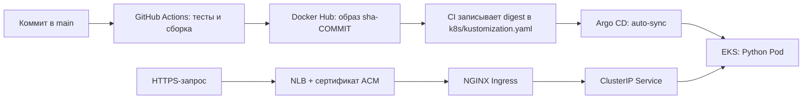

# FinalDanProject

Учебный проект: Python → Docker Hub → Git → Argo CD → Amazon EKS.
GitHub-репозиторий: [fate-it/FinalDanProject](https://github.com/fate-it/FinalDanProject).
Все команды ниже выполняются из корня этого репозитория — папки `final_project`.

| Требование | Реализация |
| --- | --- |
| Python backend, `GET /` → `200` | `app/server.py`, порт `8000`, без сторонних runtime-зависимостей |
| Docker-образ | `Dockerfile`, пользователь `10001`, healthcheck |
| GitHub Actions → Docker Hub | `.github/workflows/build-and-push.yaml`, GitHub Secrets |
| EKS: одна node group, один node | `terraform/eks`, `min/desired/max = 1` |
| NGINX Ingress, HTTPS и DNS | `terraform/platform/ingress.tf`, `acm.tf` |
| Argo CD через Terraform и Helm | `terraform/platform/argocd.tf` |
| Deployment, Service, Ingress | `k8s/`, собираются Kustomize |
| Автоматическая доставка | `argocd/application.yaml`, auto-sync, prune, self-heal |



## Параметры перед запуском

Преподаватель разрешил использовать собственный домен для личного AWS-аккаунта.
Номер группы сохраняется в DNS-именах как `devops13`.
Домен проекта `serhii-devops13.pp.ua` зарегистрирован и активирован.
В конфигурации используются группа `13`, регион `eu-central-1` и выбранное имя кластера `student1`.
Docker Hub username — `kuzmenkoserhii053`, repository — `finaldan-backend`.
До первого развертывания укажите свои значения:

| Параметр | Где задать |
| --- | --- |
| Уникальное имя кластера | `terraform/eks/terraform.tfvars`: `cluster_name` |
| Номер группы | Там же: `group_number = 13`; добавляет `devops13` в DNS-имена |
| Регион AWS | Там же: `region` |
| Свой домен или делегированный поддомен | Там же: `zone_name`; `devops13` добавляется автоматически |
| Ваш внешний IPv4 + `/32` | Там же: `api_allowed_cidrs` |
| Имя приложения в DNS | `k8s/ingress.yaml`: `app.<cluster_name>.devops<group_number>.<zone_name>` |
| Docker Hub username | GitHub Secret `DOCKERHUB_USERNAME`: `kuzmenkoserhii053` |
| Docker Hub access token с правом записи | GitHub Secret `DOCKERHUB_TOKEN` |
| Имя Docker Hub repository | GitHub Variable `DOCKERHUB_REPOSITORY`; по умолчанию `finaldan-backend` |

Нужны AWS CLI, Terraform `>= 1.10`, kubectl совместимой с EKS версии,
Docker и Python `>= 3.10`. Для EKS `1.35` используйте kubectl `1.34–1.36`.
Helm CLI для развертывания не требуется: chart устанавливает Terraform provider.

AWS-профиль должен иметь доступ к EKS, EC2/VPC, IAM, Elastic Load Balancing,
ACM и существующей **публичной** Route 53 hosted zone вашего домена. Зона должна быть
делегирована в DNS. Если доступ требует MFA, сначала получите действующую
MFA/SSO-сессию. Пример настройки окружения:

```bash
export AWS_PROFILE=your-danit-profile
aws sts get-caller-identity
```

Используйте один AWS principal для создания EKS и установки platform: создатель
получает доступ администратора к Kubernetes через EKS access configuration.
Если профиль настроен иначе, используйте стандартную AWS credential chain.
AWS-ключи, Docker Hub token и пароль Argo CD не нужно записывать в исходники.

Если `aws sts get-caller-identity` показывает ARN, оканчивающийся на `:root`,
это корневой пользователь аккаунта. Для повседневной работы с Terraform
настройте отдельный IAM-профиль пользователя или роли с нужными правами,
желательно с временными credentials, и используйте его для обоих Terraform root.
Это [рекомендация AWS](https://docs.aws.amazon.com/IAM/latest/UserGuide/root-user-best-practices.html).

## Свой домен и DNS перед развертыванием

Для текущей конфигурации домен можно зарегистрировать у внешнего регистратора,
а DNS обслуживать в Route 53. Регистрация домена и создание hosted zone — разные
действия: одна только зона в AWS не регистрирует домен и не делает вас его владельцем.

1. Домен `serhii-devops13.pp.ua` уже зарегистрирован через NIC.UA и активирован в DRS.
   Для повторения проекта с другим доменом используйте [официальную инструкцию](https://pp.ua/):
   выбрать аккредитованного регистратора, подать заявку и подтвердить активацию.
   Нужна возможность менять NS-серверы домена.
2. Для этого проекта **Public hosted zone** `serhii-devops13.pp.ua` уже создана
   в Route 53: ID `Z0642696141A05AT6JBDE`. Она управляется отдельно от Terraform проекта.
   При повторении проекта в другом аккаунте создайте зону через
   AWS Route 53 → Hosted zones → Create hosted zone. Создание зоны не зависит от региона EKS.
3. Скопируйте четыре NS-сервера из созданной зоны. В панели регистратора укажите
   их как авторитетные серверы домена и дождитесь обновления делегации.
   [Порядок настройки Route 53](https://docs.aws.amazon.com/Route53/latest/DeveloperGuide/MigratingDNS.html).
4. Укажите имя этой зоны в `terraform/eks/terraform.tfvars`, параметр `zone_name`.
   Номер группы задайте отдельно: `group_number = 13`.
   В `k8s/ingress.yaml` задайте `app.<cluster_name>.devops13.<zone_name>`.

NS-серверы созданной зоны, установленные для домена в NIC.UA:

```text
ns-36.awsdns-04.com
ns-1106.awsdns-10.org
ns-1763.awsdns-28.co.uk
ns-668.awsdns-19.net
```

Активация и делегация домена завершены. Проверка 7 сентября 2026 года напрямую
на всех трёх NS-серверах реестра `.pp.ua` подтвердила делегацию на перечисленные
серверы AWS; DNS-зона Route 53 также отвечает с этим набором NS.

Если домен уже используется для сайта или почты, можно делегировать отдельный
поддомен: создайте для него Public hosted zone и добавьте её NS-записи в родительской
DNS-зоне. Тогда `zone_name` должен содержать именно этот поддомен.
Метка `devops13` добавляется Terraform автоматически после имени кластера;
не добавляйте её повторно в `zone_name`.

Для текущего домена задайте `zone_name = "serhii-devops13.pp.ua"`, `group_number = 13`.
При имени кластера `student1` адрес приложения — `app.student1.devops13.serhii-devops13.pp.ua`,
адрес Argo CD — `argocd.student1.devops13.serhii-devops13.pp.ua`.
При выборе другого имени кластера обновите соответствующую часть hostname в `k8s/ingress.yaml`.
Записи приложения, Argo CD и ACM-валидации создаст `terraform/platform`.

Route 53 DNS платный даже при бесплатной регистрации домена: для первых 25 зон
базовая стоимость — $0.50 за зону в месяц плюс DNS-запросы
([тарифы AWS](https://aws.amazon.com/route53/pricing/)).
Зона создаётся до проекта отдельно и сохраняется после `terraform destroy`;
если она больше не нужна, удалите её отдельно после удаления записей проекта.

## 1. Локальная проверка backend

```bash
python3 -m venv .venv
source .venv/bin/activate
python -m pip install -r requirements-dev.txt
python -m unittest discover -s tests -v
python app/server.py
```

В другом терминале:

```bash
curl -i http://127.0.0.1:8000/
# HTTP/1.0 200 OK
# {"status": "ok", "version": "local"}
```

Либо остановите локальный Python-процесс и запустите Docker:

```bash
docker build -t finaldan-backend:local .
docker run --rm --read-only --cap-drop=ALL --security-opt=no-new-privileges \
  -p 127.0.0.1:8000:8000 finaldan-backend:local
```

## 2. GitHub и Docker Hub

1. Создайте **публичный** Docker Hub repository `kuzmenkoserhii053/finaldan-backend`.
   Публичность позволяет EKS скачивать образ без `imagePullSecrets`.
2. В GitHub → Settings → Secrets and variables → Actions добавьте repository
   secrets `DOCKERHUB_USERNAME` и `DOCKERHUB_TOKEN`. Token создаётся в Docker Hub;
   ему достаточно прав Read/Write для публикации. Это не пароль аккаунта.
3. Если имя repository отличается, задайте Actions variable `DOCKERHUB_REPOSITORY`.
   В этой переменной хранится только имя, без username и `docker.io/`.
4. В Settings → Actions → General → Workflow permissions разрешите запись
   содержимого репозитория. Job `update-manifests` использует `contents: write`.
   Правила защиты `main` должны разрешать этому workflow коммитить обновление
   digest; обязательный PR без исключения для бота заблокирует этот шаг.
5. Убедитесь, что Argo CD сможет читать GitHub repository: для этого учебного
   сценария проще использовать публичный репозиторий. Настройка private Git
   приведена ниже.
6. После настройки DNS hostname в `k8s/ingress.yaml` отправьте проект в `main`:

```bash
git add README.md .gitignore .dockerignore Dockerfile app tests scripts \
  requirements-dev.txt .github k8s argocd terraform EKS
git commit -m "Implement EKS GitOps final project"
git push origin main
```

Workflow проверит HTTP-ответы, соберёт и запустит контейнер, затем загрузит образ
с тегом `sha-<полный commit SHA>`. Только после успешной публикации отдельный job
запишет `docker.io/<username>/<repository>@sha256:...` в Git через Kustomize.

**Перед созданием Argo CD Application дождитесь первого успешного workflow и
bot-коммита в `k8s/kustomization.yaml`.** Начальный нулевой digest —
явная заглушка; такой образ не существует. После CI выполните
`git pull --ff-only`, чтобы локальная копия содержала опубликованный digest.

Pull request запускает проверки и Docker smoke test. Публикация образа и запись
digest выполняются только для `main`. Bot-коммиты через `GITHUB_TOKEN` не запускают
новый push-workflow. Если во время сборки появился более свежий коммит, старая
сборка пропустит изменение манифеста: его обновит workflow нового коммита.

## 3. Создание EKS

Рабочая конфигурация адаптирована из предоставленной папки `EKS/`.
Исходники курса оставлены в ней для сравнения; команды Terraform выполняются
в `terraform/eks` и `terraform/platform`.

```bash
cp terraform/eks/terraform.tfvars.example terraform/eks/terraform.tfvars
# Отредактируйте terraform.tfvars, в том числе замените 203.0.113.10/32.
# Согласуйте host в k8s/ingress.yaml с cluster_name, group_number и zone_name и отправьте его в Git.

terraform -chdir=terraform/eks init
terraform -chdir=terraform/eks fmt -check
terraform -chdir=terraform/eks validate
terraform -chdir=terraform/eks plan -out=eks.tfplan
terraform -chdir=terraform/eks apply eks.tfplan
```

Создаются отдельная VPC, две публичные подсети в разных Availability Zones,
Internet Gateway, таблица маршрутизации, IAM-роли, EKS и одна managed node group
с одним `t3.medium`, AL2023. Node получает публичный IP для исходящего доступа к
Docker Hub; NAT Gateway не создаётся. Основные add-ons — VPC CNI, kube-proxy,
CoreDNS — подбираются для указанной версии EKS. Публичный API ограничен вашими
CIDR; worker общается с control plane через приватный endpoint.

После завершения используйте команду из output `configure_kubectl` либо:

```bash
FINAL_CLUSTER=$(terraform -chdir=terraform/eks output -raw cluster_name)
FINAL_REGION=$(terraform -chdir=terraform/eks output -raw region)
aws eks update-kubeconfig --name "$FINAL_CLUSTER" --region "$FINAL_REGION"
kubectl get nodes
aws eks list-nodegroups --cluster-name "$FINAL_CLUSTER" --region "$FINAL_REGION"
```

Ожидается одна node group и один `Ready` node. Во время обслуживания EKS может
временно увеличить число EC2 instances для замены node; штатный размер группы — 1.

## 4. NGINX, ACM, DNS и Argo CD

```bash
terraform -chdir=terraform/platform init
terraform -chdir=terraform/platform validate
terraform -chdir=terraform/platform plan -out=platform.tfplan
terraform -chdir=terraform/platform apply platform.tfplan
```

Второй Terraform root читает outputs первого из его локального state. Сначала
к существующему EKS подключаются Kubernetes/Helm providers, используя обновляемый
токен `aws eks get-token`. Затем создаются:

- ACM wildcard-сертификат `*.<cluster_name>.devops<group_number>.<zone_name>` с DNS-валидацией;
- Helm release `ingress-nginx`, Service типа LoadBalancer и публичный AWS NLB;
- CNAME `app.<cluster_name>.devops<group_number>.<zone_name>` и `argocd.<cluster_name>.devops<group_number>.<zone_name>` на NLB;
- Helm release `argocd` с Ingress и опросом Git каждые 60 секунд.

NGINX использует интеграцию `aws-load-balancer-type: nlb` из примера курса:
Service обслуживает встроенный в EKS AWS service controller. Auto Mode и
отдельный AWS Load Balancer Controller здесь не включаются. Cross-zone balancing
позволяет NLB из обеих подсетей отправлять трафик на единственный node.

NLB завершает HTTPS с сертификатом ACM. Его HTTPS listener направляет HTTP
в NGINX, затем в Argo CD или backend. Входящий HTTP отправляется на отдельный
порт NGINX `2443`, который возвращает `308` на HTTPS. Поэтому отключение
`ssl-redirect` на Ingress не оставляет публичный HTTP-интерфейс Argo CD открытым
для входа и не создаёт цикл HTTPS-редиректов.

Вместо ExternalDNS Terraform управляет только двумя записями проекта и
валидацией сертификата. EBS CSI не устанавливается: выбранные компоненты
работают без PersistentVolume. Конфигурация Argo CD рассчитана на один node:
HA, Dex, ApplicationSet и notifications выключены.

```bash
terraform -chdir=terraform/platform output
kubectl -n ingress-nginx get pods,svc
kubectl -n argocd get pods,ingress
```

Адрес Argo CD находится в output `argocd_url`. Username — `admin`.
Получите начальный пароль **в своём терминале**, войдите через HTTPS и измените его:

```bash
kubectl -n argocd get secret argocd-initial-admin-secret \
  -o jsonpath='{.data.password}' | base64 --decode
```

Для Argo CD CLI используйте `argocd login <argocd-hostname> --grpc-web`.

## 5. Включение автоматической доставки

Убедитесь, что первый Docker-образ уже опубликован, Git содержит его реальный
digest, а hostname приложения совпадает с output `app_url` без `https://`.

```bash
git pull --ff-only
kubectl kustomize k8s
kubectl apply -f argocd/application.yaml
kubectl -n argocd get application backend -w
```

Application следит за веткой `main`, папкой `k8s` в GitHub. Argo CD самостоятельно
создаёт namespace `backend`, применяет Kustomize, удаляет ресурсы, удалённые из
Git (`prune`), и исправляет изменения, сделанные вручную в кластере (`selfHeal`).
Для первичной синхронизации возможна небольшая задержка. Дождитесь `Synced` и
`Healthy`, затем проверьте:

```bash
kubectl -n backend rollout status deployment/backend --timeout=180s
kubectl -n backend get deployment,pods,service,ingress
FINAL_APP_URL=$(terraform -chdir=terraform/platform output -raw app_url)
curl --fail --show-error "$FINAL_APP_URL/"
```

Ответ: `{"status": "ok", "version": "<SHA исходного коммита>"}`.
Для демонстрации обновления добавьте комментарий в `app/server.py`, закоммитьте
и отправьте в `main`: поле `version` в ответе покажет новый SHA сборки.
После CI и bot-коммита Argo CD
обнаружит новый digest и выполнит rolling update Deployment. Коммиты, меняющие
только Kubernetes-манифесты, также автоматически синхронизируются. Несколько
быстрых коммитов могут объединиться в доставку последнего состояния `main`.

При ошибке авторизации Git подключите private repository через Argo CD:
Settings → Repositories → Connect Repo, HTTPS с GitHub token на чтение либо SSH
deploy key. Учетные данные храните в Kubernetes Secret Argo CD, не в Application
и не в Git. Для private Docker Hub repository дополнительно потребуется
`imagePullSecret` в namespace `backend` и ссылка на него в Deployment.

## Проверки и диагностика

```bash
python -m unittest discover -s tests -v
terraform fmt -check -recursive terraform
terraform -chdir=terraform/eks validate
terraform -chdir=terraform/platform validate
kubectl kustomize k8s
```

Workflow `validate.yaml` проверяет Terraform и рендеринг Kustomize без AWS-ключей.
`terraform validate` не заменяет реальный AWS `plan/apply`: права IAM, доступность
зоны, квоты и сетевую доступность можно проверить только в целевом аккаунте.

Локально проверены: 5 Python-тестов, Docker build и запуск контейнера (HTTP 200,
UID 10001, read-only filesystem, завершение по SIGTERM), оба Terraform root,
оба workflow через actionlint, рендеринг Kustomize и обоих Helm charts.
Docker smoke test на этой машине выполнялся с `--network none` через loopback
контейнера, поскольку локальное ядро не поддерживает создание Docker veth bridge.
Публикация в Docker Hub, GitHub Actions и AWS-развертывание ещё не выполнялись.

| Симптом | Проверка |
| --- | --- |
| DNS не разрешается / ACM ожидает подтверждение | Существование и делегация hosted zone; права Route 53; записи в AWS |
| `AccessDenied` от AWS | `aws sts get-caller-identity`, профиль и срок MFA/SSO-сессии |
| EKS API недоступен | Текущий публичный IP должен входить в `api_allowed_cidrs` |
| `ImagePullBackOff` | Первый успешный CI, digest в Git, публичность образа; `kubectl -n backend describe pod <pod>` |
| CI не может обновить Git | `contents: write`, workflow permissions и правила защиты `main` |
| Service LoadBalancer остаётся pending | `kubectl -n ingress-nginx describe service ingress-nginx-controller`, события, теги подсетей и квоты ELB |
| Argo CD `ComparisonError` | Доступ к GitHub, ветка `main`, путь `k8s` |

## State, версии и удаление

Terraform state хранится локально в двух отдельных каталогах и исключён из Git,
как и `.tfvars`, планы и `.terraform/`. Сохраняйте state до удаления инфраструктуры.
Файлы `.terraform.lock.hcl` коммитятся. S3 backend с общим ключом из исходного
примера намеренно не используется. При переходе на S3 задайте собственные bucket
и **разные** state keys для двух root-модулей, включите блокировку и обновите
`terraform_remote_state` в `terraform/platform/providers.tf`.

Созданные EKS, EC2, NLB и публичные IPv4 оплачиваются AWS. После сдачи проекта
удаляйте ресурсы в порядке Application → platform → EKS:

```bash
kubectl delete -f argocd/application.yaml --wait=true --timeout=180s
terraform -chdir=terraform/platform destroy
# Дождитесь удаления NLB и его сетевых ресурсов, затем:
terraform -chdir=terraform/eks destroy
```

Finalizer Application удалит управляемые Deployment, Service и Ingress, пока
Argo CD ещё работает. Не удаляйте EKS раньше platform: Helm и Kubernetes
providers нужны работающий API и IAM-доступ для очистки LoadBalancer.

По требованию задания используется community `ingress-nginx` `4.15.1`.
Этот проект [завершил сопровождение в марте 2026](https://kubernetes.io/blog/2026/01/29/ingress-nginx-statement/),
поэтому эта конфигурация предназначена для учебного задания; для рабочего
окружения требуется поддерживаемый ingress controller. Argo CD chart закреплён
на `9.4.11`, EKS — на `1.35` (версию можно изменить в `.tfvars`).

Документация: [версии EKS](https://docs.aws.amazon.com/eks/latest/userguide/kubernetes-versions.html),
[NGINX и TLS на AWS NLB](https://kubernetes.github.io/ingress-nginx/deploy/#aws),
[Argo CD auto-sync](https://argo-cd.readthedocs.io/en/stable/user-guide/auto_sync/),
[события workflow и GITHUB_TOKEN](https://docs.github.com/en/actions/how-tos/writing-workflows/choosing-when-your-workflow-runs/triggering-a-workflow).
